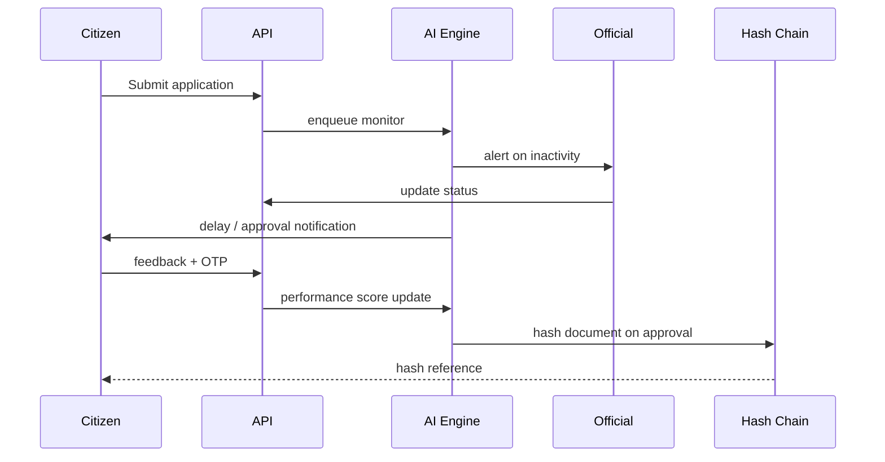

## AI Workflow Engine

The AI module is rule-based but extensible for ML models. It continuously monitors states, calculates delay scores, and triggers actions.

### Monitoring Loop

1. **Data ingestion**: Each application mutation persists timestamps (`createdAt`, `updatedAt`, `lastOfficialActionAt`).
2. **Score computation**: `DelayDetectorService` compares last update vs configurable threshold to derive `aiDelayScore` (0–1.5).
3. **Alerting**: If score ≥ 0.8, officials and citizens receive proactive notifications.
4. **Auto-approval**: After `autoApproveDays` (default 30), pending cases transition to `AUTO_APPROVED` and blockchain hashing kicks in.
5. **Feedback analytics**: Verified feedback updates application average rating; aggregated on dashboards for performance scoring.

### Bottleneck Recommendations

- **High `aiDelayScore`**: Suggests more reviewers or auto-escalation.
- **Low feedback rating**: Flags official for coaching.
- **Repeated auto approvals**: Highlights process gaps since manual review never happened.

