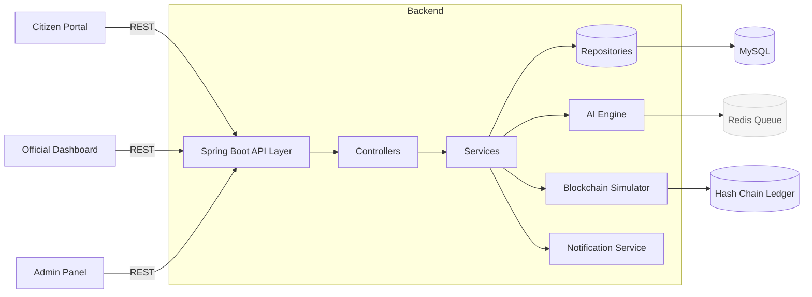

## System Architecture

The platform follows a clean separation of concerns with Spring Boot powering the backend APIs, vanilla HTML/CSS/JS on the frontend, and MySQL for persistence. Redis can be turned on for caching AI tasks, while the blockchain simulator anchors hashes locally.

### Logical View

### Deployment View

- **Backend**: Spring Boot fat JAR running behind Nginx or IIS reverse proxy.
- **Database**: Managed MySQL (RDS/Azure MySQL) with nightly backups.
- **Caching/Queueing**: Optional Redis or Azure Cache for AI scanning tasks.
- **Frontend**: Static assets served from CDN / S3 / Azure Blob Static Website.
- **CI/CD**: GitHub Actions building Maven project, running tests, pushing container image. Kubernetes/VM deployment with `.env` driven configuration.

