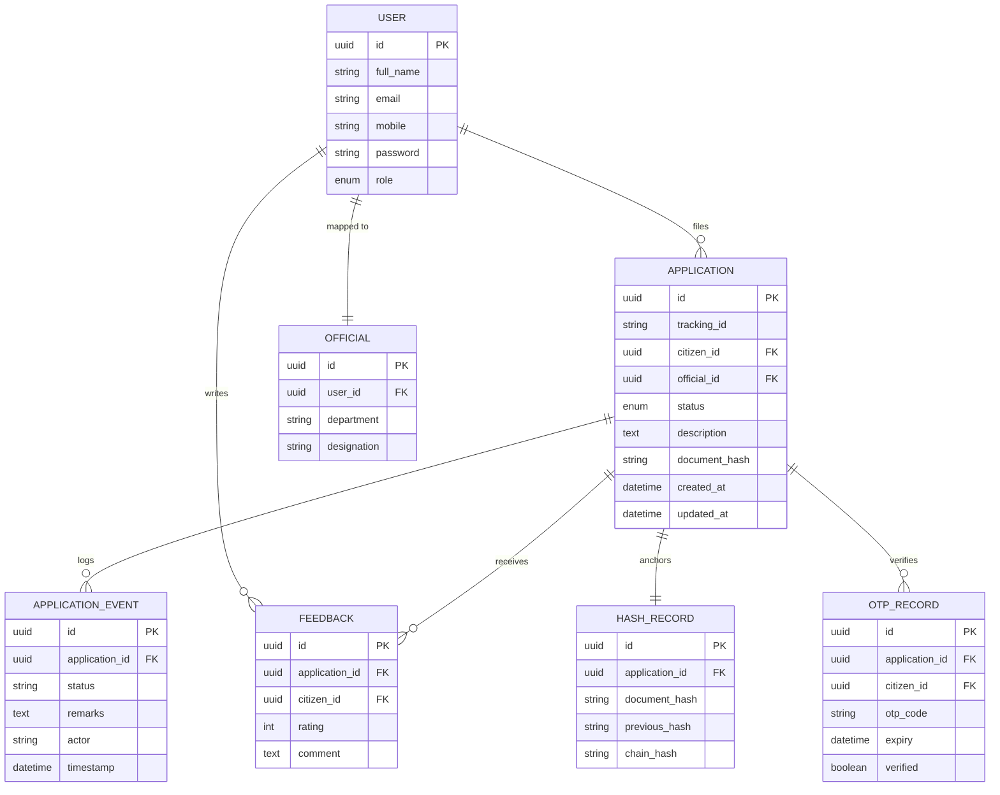

## MySQL ER Diagram

```mermaid
erDiagram
    USER ||--o{ APPLICATION : files
    USER ||--o{ FEEDBACK : writes
    USER ||--|| OFFICIAL : "mapped to"
    APPLICATION ||--o{ APPLICATION_EVENT : logs
    APPLICATION ||--o{ FEEDBACK : receives
    APPLICATION ||--|| HASH_RECORD : anchors
    APPLICATION ||--o{ OTP_RECORD : verifies

    USER {
        uuid id PK
        string full_name
        string email
        string mobile
        string password
        enum role
    }

    OFFICIAL {
        uuid id PK
        uuid user_id FK
        string department
        string designation
    }

    APPLICATION {
        uuid id PK
        string tracking_id
        uuid citizen_id FK
        uuid official_id FK
        enum status
        text description
        string document_hash
        datetime created_at
        datetime updated_at
    }

    APPLICATION_EVENT {
        uuid id PK
        uuid application_id FK
        string status
        text remarks
        string actor
        datetime timestamp
    }

    FEEDBACK {
        uuid id PK
        uuid application_id FK
        uuid citizen_id FK
        int rating
        text comment
    }

    OTP_RECORD {
        uuid id PK
        uuid application_id FK
        uuid citizen_id FK
        string otp_code
        datetime expiry
        boolean verified
    }

    HASH_RECORD {
        uuid id PK
        uuid application_id FK
        string document_hash
        string previous_hash
        string chain_hash
    }
```

